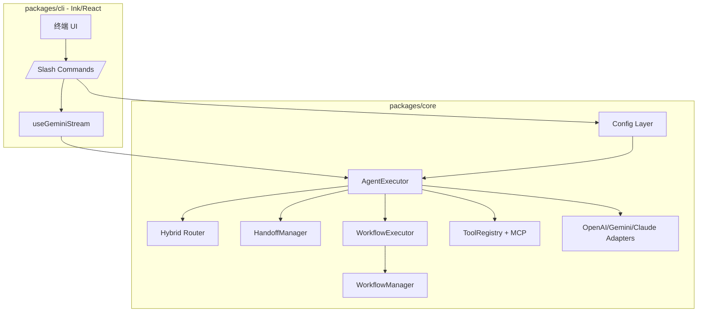
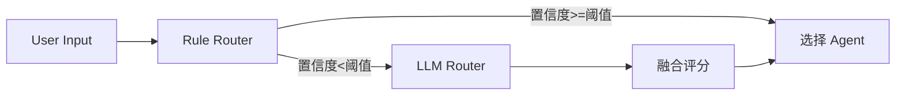
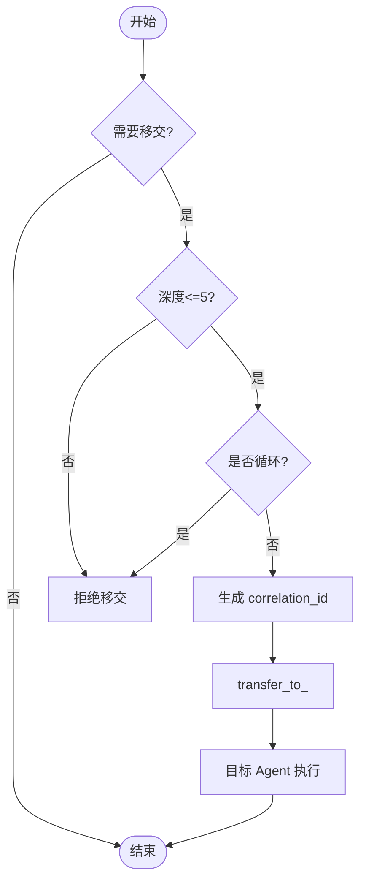
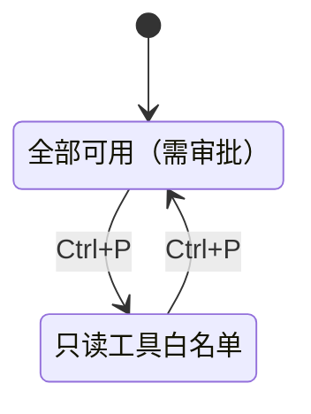
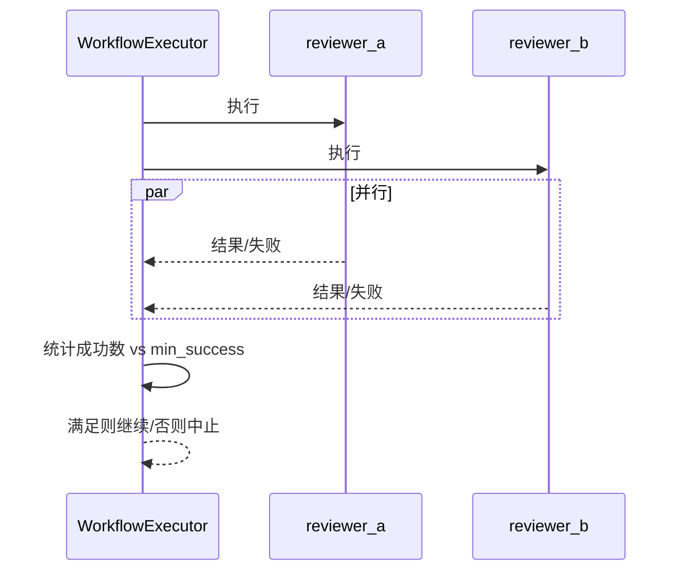
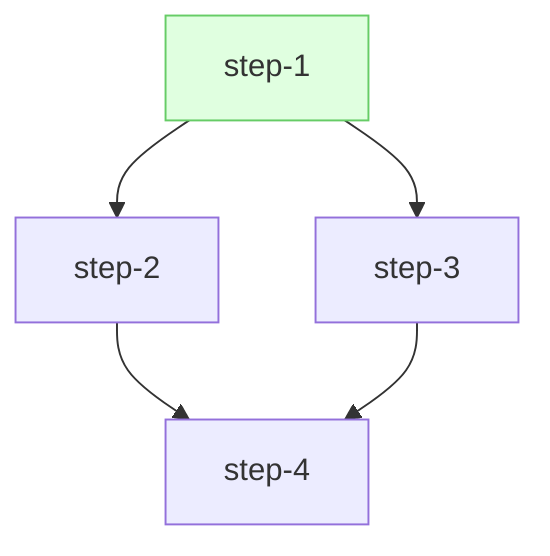

## 伏羲 CLI（fuxi-cli）技术分享：从 Gemini CLI 到面向企业的 AI 终端生产力平台

> 面向架构师与资深工程师的技术解读与实践经验总结

---

### 1. 项目背景与定位

伏羲 CLI（fuxi-cli）是在 Google Gemini CLI 的基础上进行深度增强与本土化优化的 AI 命令行工具。我们在保持原有强大能力（超大上下文、丰富工具、MCP 协议、终端优先等）的前提下，围绕国内开发者与企业团队的实际需求，提供了以下核心能力：

- 自定义模型接入（通义千问、DeepSeek、本地模型、任意 OpenAI 兼容服务）
- Agents 智能体系统（专业化分工、上下文隔离、工具最小权限）
- 智能路由与移交（rule/llm/hybrid 三策略，Agent 间协作）
- Workflow 工作流（顺序与并行编排、条件与错误策略、模板变量）
- Plan+Todo 双阶段模式（先规划、后执行，安全可控，支持批量执行）
- Spec 规格驱动开发（Constitution → Spec → Plan → Tasks → Execute 全链路）

定位上，fuxi-cli 面向“企业级 AI 终端生产力平台”，强调配置驱动、类型安全、可审计与可扩展，适合个人开发者到中大型团队在本地/内网/容器化环境中低门槛落地。

---

### 2. 核心技术创新

#### 2.1 通用模型支持系统（Unified Provider Strategy）

痛点：不同厂商（Qwen、DeepSeek、Moonshot、智谱等）接口细节差异造成接入成本高、维护难度大。

方案：统一使用 `provider: "openai"` 的适配器与配置驱动策略，将差异收敛至以下维度：

- baseUrl：服务端点
- metadata.providerName：身份标识（影响系统提示词与“自报家门”）
- capabilities：模型能力（是否支持函数调用、multimodal 等）
- envKeyNames：API Key 环境变量的自动发现顺序

示例：

```json
{
  "useModelRouter": true,
  "defaultModel": "qwen3-coder-flash",
  "models": {
    "qwen3-coder-flash": {
      "provider": "openai",
      "model": "qwen3-coder-flash",
      "apiKey": "sk-your-api-key",
      "baseUrl": "https://dashscope.aliyuncs.com/compatible-mode/v1",
      "metadata": { "providerName": "qwen", "displayName": "通义千问" },
      "capabilities": { "maxOutputTokens": 8192, "supportsFunctionCalling": true, "supportsMultimodal": true }
    },
    "deepseek-coder": {
      "provider": "openai",
      "model": "deepseek-coder",
      "apiKey": "sk-your-api-key",
      "baseUrl": "https://api.deepseek.com",
      "metadata": { "providerName": "deepseek", "displayName": "DeepSeek" },
      "capabilities": { "maxOutputTokens": 4096, "supportsFunctionCalling": false, "supportsMultimodal": false }
    }
  }
}
```

价值：实现“零代码扩展”与“统一接口”，极大降低模型切换与多模型并存的维护成本。同时，通过系统提示词的身份识别，保证了使用体验的一致性与可解释性。

——

#### 2.2 Agents 智能体系统（专业化分工 + 最小权限）

目标：让不同职责的 Agent 在清晰的边界内高效协作。核心设计：

- 上下文模式：`isolated`（默认，安全）与 `shared`（需要时共享）
- 工具隔离：MCP 服务器级过滤 + 工具白/黑名单两级过滤
- 系统提示词：职责边界与移交规则显式化
- 触发器与路由：关键词/正则/LLM/混合策略

Agent 定义片段：

```yaml
---
kind: agent
name: code_review
title: 代码审查助手
model: deepseek-coder
contextMode: shared
tools:
  allow: ["read_file","read_many_files","ls","glob","grep","rg","web_fetch","web_search"]
handoffs:
  - to: code_imple
    when: manual
    description: "当需要实现/修复代码时移交"
    include_context: true
---
```

——

#### 2.3 智能路由与移交（Routing & Handoff）

- 路由：rule（<10ms）、llm（1–3s）、hybrid（10–100ms，推荐）。先规则后 LLM，取最高分。
- 移交：Handoff-as-Tool。自动注入 `transfer_to_<agent>` 工具，含循环检测、深度限制、correlation_id 追踪。

一键路由并执行：

```bash
/agents route "帮我审查这段代码" --execute
```

——

#### 2.4 Workflow 工作流（顺序 + 并行 + 条件 + 错误策略）

YAML 即定义，具备模板变量系统与并行分组：

```yaml
---
kind: workflow
name: code-quality-pipeline
steps:
  - id: review
    agent: code_review
    input: "${workflow.input}"
  - id: fix
    agent: code_imple
    when: "${review.data.issues_found} > 0"
    input: "修复以下问题：${review.output}"
  - id: test
    agent: test_writer
error_handling:
  on_error: continue
  max_retries: 2
timeout: 600000
---
```

并行示例（节省约 50% 时间）：

```yaml
- type: parallel
  id: dual_review
  parallel:
    - id: reviewer_a
      agent: code_review
      input: "审查：${workflow.input}"
    - id: reviewer_b
      agent: code_review_pro
      input: "安全审查：${workflow.input}"
  error_handling:
    on_error: continue
    min_success: 1
```

——

#### 2.5 Plan+Todo 双阶段模式（安全可控的“先想后做”）

Plan 模式下仅允许只读工具与 `create_plan`，避免“未经审查的修改”。计划经由 `/plan to-todos` 转为待办，支持依赖检查、单/批量执行与执行模式（`default` 审批、`auto_edit` 自动）。

典型交互：

```bash
[Ctrl+P] 进入 Plan 模式
[PLAN] > 帮我规划实现用户登录功能
/plan to-todos
/todos execute-all --mode=auto_edit
```

——

#### 2.6 Spec 规格驱动开发（SDD）

把“意图→规格→方案→任务→实施”做成可审查、可追踪的闭环：

- Constitution：工程原则与质量标准
- Specification：业务 WHAT/WHY
- Technical Plan：技术 HOW，多版本对比
- Tasks：可执行任务（依赖可视）
- Execute：批量执行与进度追踪

核心命令：

```bash
/spec constitution --init
/spec new
/spec plan new <spec-id>
/spec tasks new <plan-id>
/spec execute start <tasks-id>
```

---

### 3. 架构设计亮点

- Monorepo + npm workspaces：`packages/cli`（Ink/React 终端 UI）、`packages/core`（业务与工具）、`packages/test-utils`、`packages/vscode-ide-companion`。
- 配置分层：系统 → 用户 → 项目 → 环境变量；优先级清晰、可追踪。
- 工具系统：统一 `ToolRegistry`，文件/搜索/Shell/Web/MCP 等工具标准化；只读默认自动批准，写操作需明确确认。
- 安全与沙箱：macOS Seatbelt、容器化、受信任文件夹、审批模式，满足企业内网合规与审计。
- 性能优化：流式响应、工具并发、LRU 缓存、Ripgrep 搜索、增量构建与 Tree-shaking。

---

### 4. 技术难点与解决方案

- 统一适配：删除厂商专属 Adapter，统一到 OpenAIAdapter；通过 `metadata` 与 `capabilities` 精确刻画差异；系统提示词包含“身份自报”。
- 上下文隔离：`isolated/shared` 双模式 + 工具两级过滤，确保最小权限与信息边界。
- 并行工作流：并行分组 + `min_success` 策略，结合模板变量汇总结果；并提供条件、重试与超时控制。
- 依赖解析与批量执行：Todo 依赖严格校验与拓扑顺序执行；使用 `useRef` 规避 React 闭包陷阱，保证 `/todos execute-all` 连续推进。
- API 兼容性与鲁棒性：在消息翻译层补齐多模态/工具调用差异，清理“孤儿 tool 响应”，显著降低调用错误。

---

### 5. 典型应用场景与实践

- 代码质量流水线：`code_review → code_imple → test_writer → code_review(final)`，可用 workflow 固化，并行双审查加速。
- 多 Agent 协作开发：需求分析 → 方案制定 → 代码实现 → 测试编写 → 文档生成，自动路由与移交贯穿全程。
- 复杂任务分解：先用 Plan 模式出详细计划与风险，再转 Todos 依赖执行；核心路径走 `default`，外围走 `auto_edit`。
- 企业内网落地：通过 `.npmrc` 内网镜像、Docker 开发/生产双模式、离线依赖与本地模型（Ollama）支持，降低外网依赖。

---

### 6. 技术价值与展望

- 效率：并行审查、批量执行与智能路由显著提升人效。
- 降门槛：统一 Provider + 配置驱动，降低多模型/多团队协作成本。
- 可扩展：MCP 协议与统一工具层，便于引入内部平台能力与合规审计。
- 可治理：Plan 模式与 Spec-Driven 形成“先计划后实施”的工程纪律，适合大中型团队的可控引入。

下一步方向：

- 无依赖 Todo 的并行执行与执行报告
- 更丰富的可观测性（Tracing/Telemetry）与审计日志
- IDE 与 CI/CD 更深集成，形成从本地到流水线的一致体验

---

### 附：快速上手与参考

构建与运行：

```bash
git clone https://github.com/chenjiamin/fuxi-cli.git
cd fuxi-cli
npm install && npm run build
npm start
```

Docker（开发）：

```bash
docker build -f Dockerfile.dev -t fuxi-cli-dev .
docker run --rm -v $(pwd):/workspace -w /workspace fuxi-cli-dev npm run build
node bundle/fuxi-cli.js
```

更多文档请参考仓库中的 `README.md` 与 `design/` 目录（模型系统、Agents、路由与移交、Workflow、Plan+Todo、Spec-Driven）。

---

### 7. 核心技术突破与实现细节（进阶）

#### 7.1 路由评分与决策函数（Rule → LLM → Hybrid）

混合策略下的决策流程：

```text
score_rule = f_rule(input, triggers)
if score_rule.confidence >= threshold:
  return score_rule

score_llm = f_llm(input)
return argmax(score_rule, score_llm)
```

规则打分（关键词/正则/优先级）：

```typescript
function ruleScore(input: string, t: Triggers): { score: number; confidence: number; matched: string[] } {
  const kwMatches = (t.keywords || []).filter(k => input.includes(k));
  const reMatches = (t.patterns || []).filter(p => new RegExp(p).test(input));
  const base = kwMatches.length * 10 + reMatches.length * 15;
  const priority = (t.priority ?? 50) / 100; // 0-1
  const score = base * (1 + priority * 0.5);
  const confidence = Math.min(100, Math.round(score));
  return { score, confidence, matched: [...kwMatches, ...reMatches] };
}
```

性能特征：rule 路由 O(n+m)（n=关键词数，m=正则数），典型延迟 3–10ms；hybrid 平均 10–100ms。

#### 7.2 Handoff 安全链约束（循环、深度、关联追踪）

```typescript
const MAX_HANDOFF_DEPTH = 5;

function detectCircularHandoff(chain: string[], to: string): boolean {
  return chain.includes(to);
}

function validateHandoffDepth(depth: number): boolean {
  return depth <= MAX_HANDOFF_DEPTH;
}

function createCorrelationId(): string {
  return Math.random().toString(36).slice(2) + Date.now().toString(36);
}
```

约束组合：
- 防循环：A → B → A 拒绝；
- 深度限制：>5 层拒绝；
- 关联追踪：`correlation_id` 贯穿整条移交链，便于审计与回溯。

#### 7.3 Plan 模式工具隔离（强制白名单）

```typescript
function getUnifiedTools(all: ToolInfo[], planMode: boolean): ToolInfo[] {
  if (!planMode) return all;
  const ALLOW = new Set([
    'read_file','read_many_files','ls','glob','grep','rg','web_fetch','web_search','create_plan'
  ]);
  return all.filter(t => ALLOW.has(t.name));
}
```

该逻辑在 Core 层统一收口，任何 UI/Agent 入口都会被强制约束，避免“越权写入”。

#### 7.4 Workflow 并行执行的并发模型（min_success）

```typescript
async function runParallel(group: ParallelStepGroup): Promise<ParallelResult> {
  const results = await Promise.allSettled(group.parallel.map(execStep));
  const success = results.filter(r => r.status === 'fulfilled').length;
  const minSuccess = group.error_handling?.min_success ?? group.parallel.length;
  if (success < minSuccess && (group.error_handling?.on_error !== 'continue')) {
    throw new Error(`Parallel group failed: success=${success} < min_success=${minSuccess}`);
  }
  return aggregate(results);
}
```

典型收益：双评审并行将审查阶段用时 T 降至约 T/2，在 2–3 步汇总后统一修复。

#### 7.5 APITranslator：多模态与“孤儿 tool 响应”修复

```typescript
function unifiedToOpenAI(messages: UnifiedMsg[], supportsMultimodal: boolean) {
  return messages.map(msg => {
    if (!supportsMultimodal && Array.isArray(msg.content)) {
      const text = msg.content.filter(p => p.type === 'text').map(p => p.text ?? '').join('\n');
      return { role: msg.role, content: text };
    }
    return { role: msg.role, content: msg.content };
  });
}

function fixOrphanToolMessages(stream: APIMessage[]): APIMessage[] {
  const result: APIMessage[] = [];
  const removed = new Set<string>();
  for (const m of stream) {
    if (m.role === 'assistant' && m.tool_calls) {
      const valid = m.tool_calls.filter(tc => isValidToolCall(tc));
      const invalidIds = m.tool_calls.filter(tc => !valid.includes(tc)).map(tc => tc.id);
      invalidIds.forEach(id => removed.add(id));
      result.push(valid.length ? { ...m, tool_calls: valid } : { role: 'assistant', content: m.content || '' });
    } else if (m.role === 'tool') {
      if (!removed.has(m.tool_call_id)) result.push(m);
    } else {
      result.push(m);
    }
  }
  return result;
}
```

效果：跨厂商 API 兼容性增强，显著降低 4xx/422 类协议错误。

#### 7.6 Todo 依赖图与拓扑执行（DAG）

```typescript
function topoOrder(nodes: string[], edges: Array<[string,string]>): string[] {
  const indeg = new Map<string, number>(nodes.map(n => [n, 0]));
  for (const [u,v] of edges) indeg.set(v, (indeg.get(v) || 0) + 1);
  const q = nodes.filter(n => (indeg.get(n) || 0) === 0);
  const order: string[] = [];
  while (q.length) {
    const u = q.shift()!; order.push(u);
    for (const [x,y] of edges) if (x === u) {
      indeg.set(y, (indeg.get(y) || 0) - 1);
      if ((indeg.get(y) || 0) === 0) q.push(y);
    }
  }
  if (order.length !== nodes.length) throw new Error('Cyclic dependency');
  return order;
}
```

保证 `/todos execute-all` 的严格依赖顺序与可预测性；未来可按层级并行无依赖节点。

#### 7.7 配置解析优先级与合并算法

优先级：`CLI 参数 > 环境变量 > 项目配置 > 用户配置 > 系统配置 > 默认值`。

```typescript
function resolveConfig(...layers: Record<string, any>[]): any {
  const out: any = {};
  for (const layer of layers) deepMerge(out, layer); // 后者覆盖前者
  return out;
}

function deepMerge(dst: any, src: any) {
  for (const k of Object.keys(src)) {
    if (isObject(src[k]) && isObject(dst[k])) deepMerge(dst[k], src[k]);
    else dst[k] = src[k];
  }
}
```

效果：统一且可审计的配置落地方式，适配企业多环境部署。

#### 7.8 性能与复杂度指标（关键路径）

- 路由：rule O(n+m)，3–10ms；hybrid 10–100ms。
- 并行工作流：分组执行耗时近似 `max(step_i)`，整体管线提速 30%–50%。
- 依赖拓扑：O(V+E)，V=todo 数，E=依赖数。
- 搜索：ripgrep 子进程 O(file_size)，配合缓存与 BFS 限深。
- 运行时内存：基于 LRU 的消息片段缓存，降低重复 token 成本。

---

### 8. 图示版（无代码展示）

#### 8.1 总体架构（组件视图）



#### 8.2 智能路由（Hybrid 决策流程）



#### 8.3 Agent 移交安全链（活动图）



#### 8.4 Plan 模式工具隔离（状态机）



#### 8.5 Workflow 并行执行（时序与门限）



#### 8.6 Todo 依赖 DAG 与拓扑顺序


